# Running and testing user-service

End-to-end guide: from a fresh clone to a running, tested service. Commands are for **Windows PowerShell**
unless marked otherwise, and are run from the `user-service` folder.

Diagrams use [Mermaid](https://mermaid.js.org/), which renders natively on GitHub. In VS Code, install the
*Markdown Preview Mermaid Support* extension and open the preview (`Ctrl+Shift+V`).

**Contents**

- [Architecture: HLD](#architecture--high-level-design-hld): system context, deployment, request pipeline, design decisions
- [Architecture: LLD](#architecture--low-level-design-lld): components, classes, data model, sequences, algorithms, Redis keys
- [1. Prerequisites](#1-prerequisites) · [2. Keys](#2-one-time-setup-jwt-signing-keys) · [3. Run](#3-run-the-application) ·
  [4. Testing](#4-testing) · [5. Configuration](#5-configuration-reference) · [6. Deploying](#6-deploying-behind-a-load-balancer--kubernetes) ·
  [7. Troubleshooting](#7-troubleshooting) · [8. Clean up](#8-stop-and-clean-up)

---

## Architecture — High-Level Design (HLD)

### H1. System context

Who talks to the service, and what it depends on.

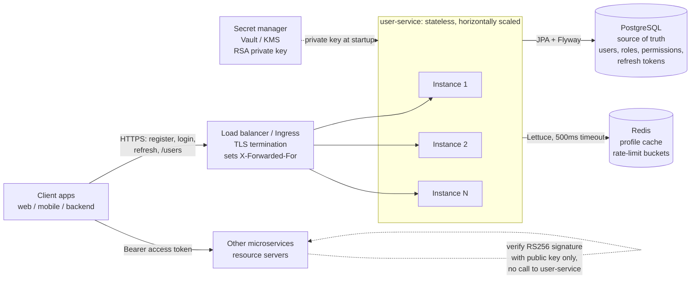

### H2. Local deployment (docker compose)

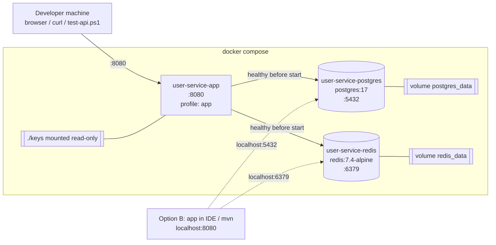

### H3. Request pipeline

Every HTTP request passes through these layers in order. Cheap rejections happen before expensive work.

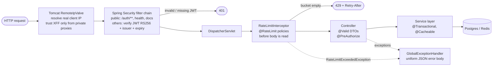

### H4. Key design decisions

| Concern | Decision | Why |
|---|---|---|
| Session model | Stateless **JWT access tokens** (RS256, 15 min) | Any instance or downstream service verifies with the public key only, with no DB or network hop |
| Long-lived sessions | Opaque **refresh tokens** (30 days), stored as SHA-256 hashes, rotated on every use; replaying a rotated token revokes all of the user's tokens | A DB leak exposes no usable tokens; rotation plus reuse detection limits how long a stolen token is useful |
| Passwords | **Argon2** | Memory-hard, so GPU cracking is resistant |
| Authorization | RBAC: user → roles → permissions, embedded as JWT claims | No per-request permission lookup |
| Source of truth | **PostgreSQL**, schema via Flyway migrations | Transactions, constraints, versioned schema |
| Redis role | Optimisation and protection only, **never** the source of truth | The app keeps working when Redis is down |
| Caching | Cache-aside on user profiles, typed JSON, TTL, versioned keys | Removes a 3-table join from the hottest read path |
| Rate limiting | Distributed token bucket, atomic Lua script, per-policy fallback | Consistent limits across instances; brute-force protection without account-lockout DoS |
| Scaling | App instances are stateless | Scale horizontally behind the load balancer |
| Observability | Actuator health groups, Micrometer counters (`rate_limiter.requests`, cache stats) | Readiness stays green during a Redis outage; overall health reports it |

---

## Architecture — Low-Level Design (LLD)

### L1. Component / package structure

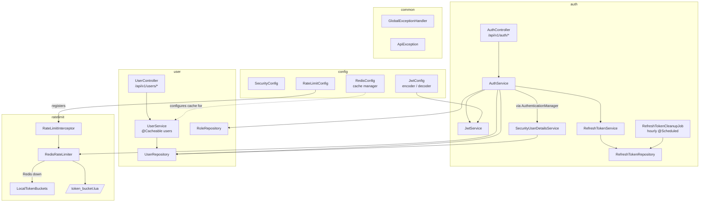

### L2. Class diagram: rate limiting

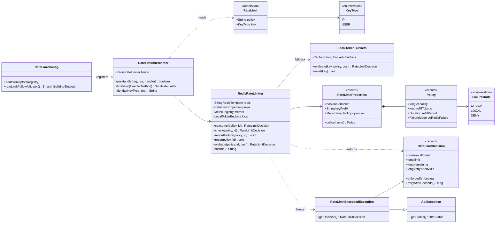

### L3. Class diagram: caching

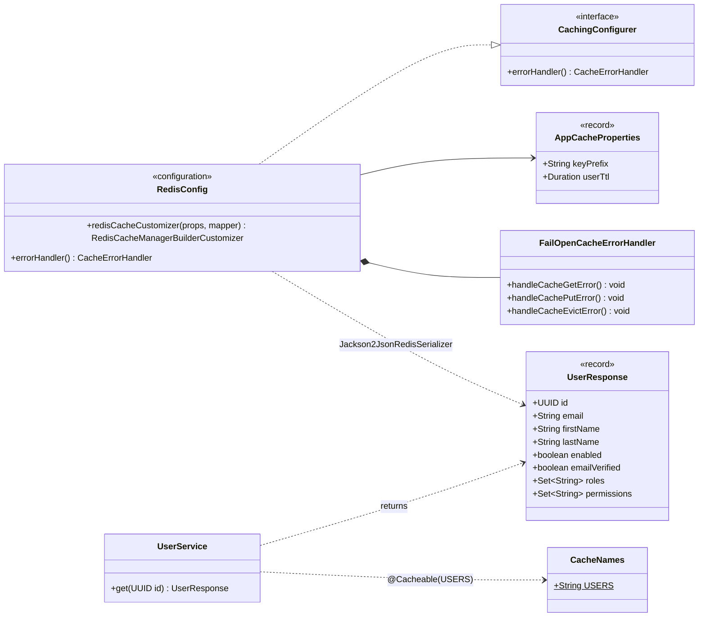

### L4. Data model (PostgreSQL)

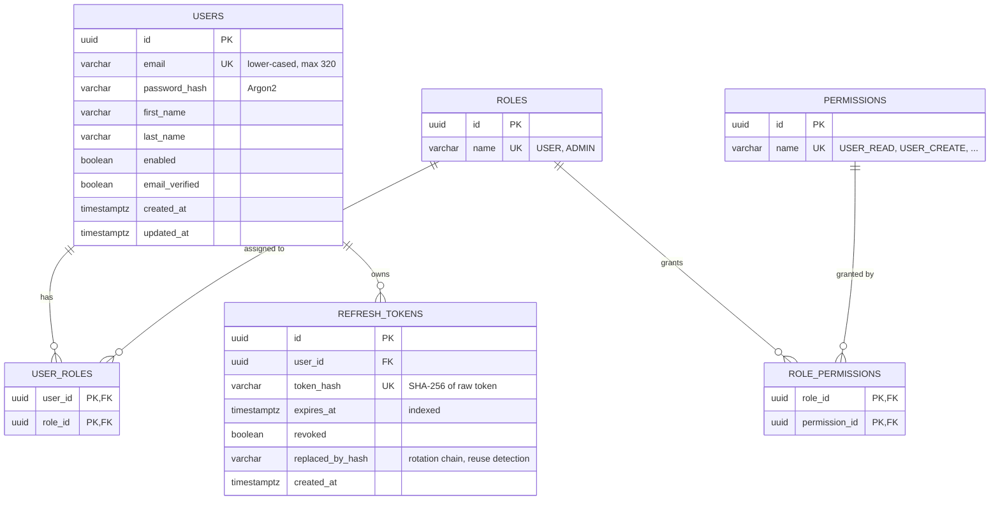

Seed data (Flyway `V2`, adjusted by `V3`): `ADMIN` → all permissions; `USER` → no permissions (`V3` removed
`USER_READ`, so a regular user can read only their own profile via `/users/me` or `/users/{own id}`). New
registrations get `USER`. `V3` also drops the unused `users.failed_login_attempts` column (failed logins are
throttled by the rate limiter).

### L5. Sequence: register

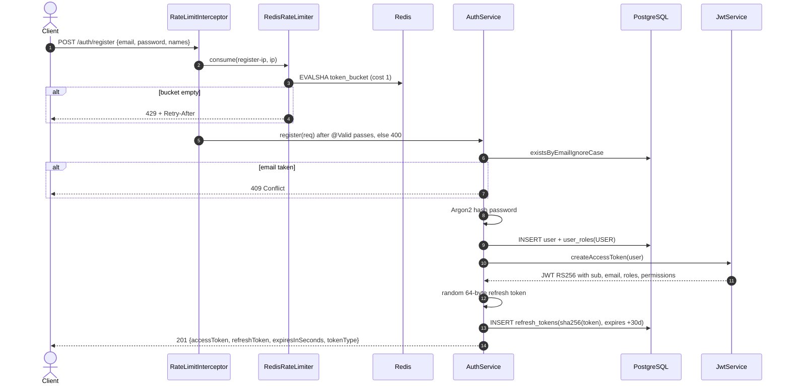

### L6. Sequence: login with brute-force protection

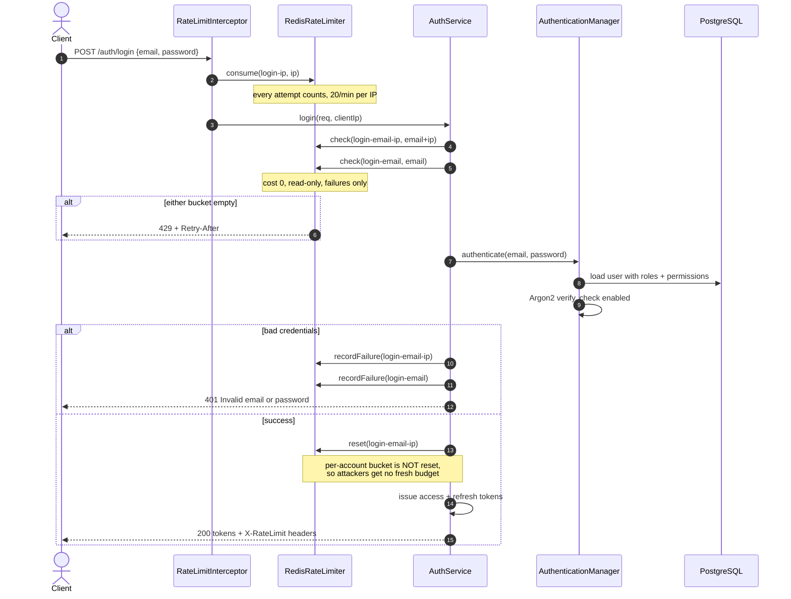

### L7. Sequence: GET /users/me (JWT + cache-aside)

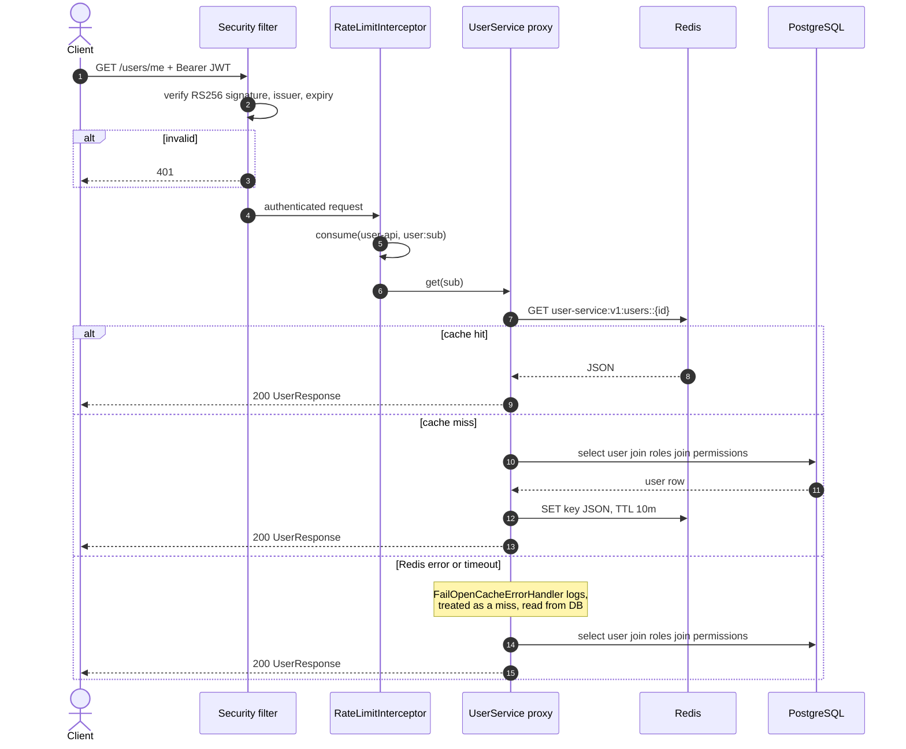

### L8. Sequence: refresh-token rotation and logout

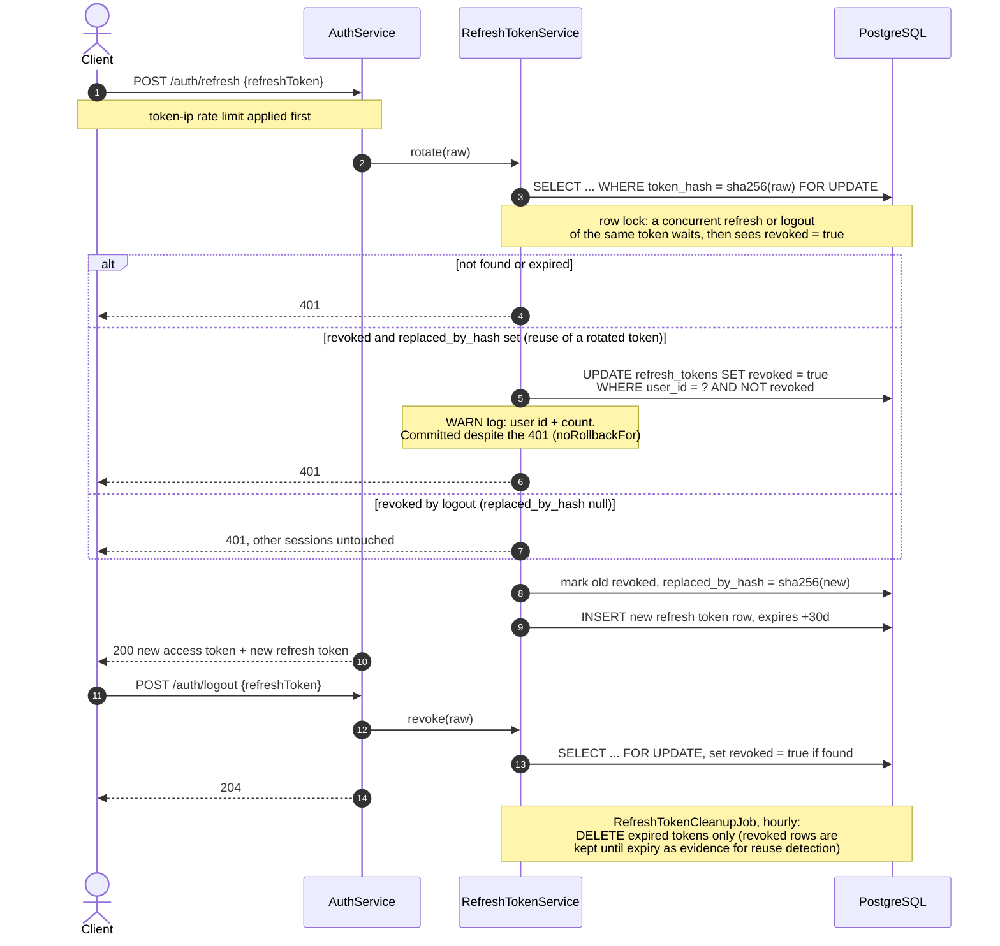

### L9. Algorithm: token bucket (`token_bucket.lua`, atomic in Redis)

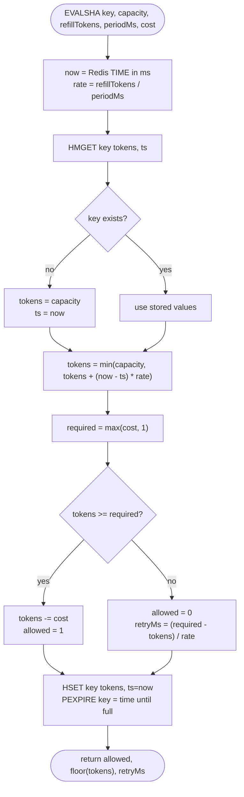

`cost = 1` consumes a token (`consume`, `recordFailure`). `cost = 0` only checks that at least one token is left
(`check`). Using Redis `TIME` keeps buckets consistent even when app servers' clocks differ.

### L10. Redis failure handling

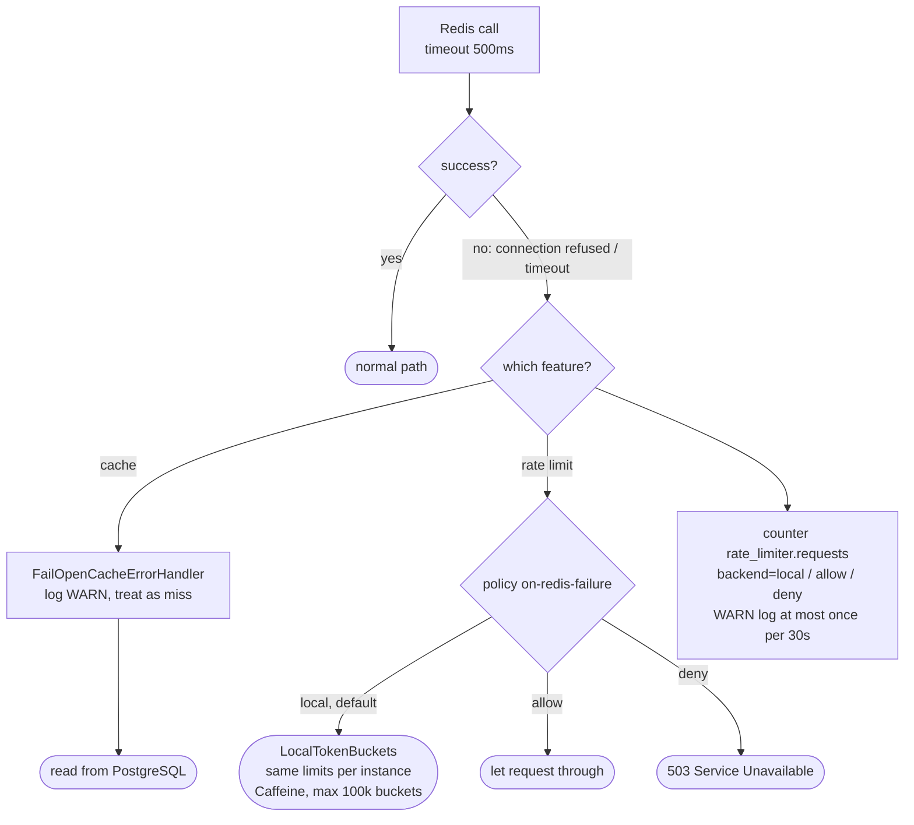

### L11. Redis key design

| Purpose | Key pattern | Type | TTL | Example value |
|---|---|---|---|---|
| User profile cache | `user-service:v1:users::{userId}` | string (JSON) | `CACHE_USER_TTL` (10 min) | `{"id":"…","email":"…","roles":["USER"],…}` |
| Rate-limit bucket | `user-service:rl:{policy}:{sha256(identity)[0..32]}` | hash | time until the bucket is full again | `tokens=4.7, ts=1759557600123` |

Identity values hashed into rate-limit keys: `ip:{clientIp}`, `user:{jwtSub}`, `{email}`, `{email}|{ip}`.
The `v1` segment lets a changed DTO shape roll out without reading old entries; the `user-service:` prefix
keeps keys separate when Redis is shared with other services.

---

## 1. Prerequisites

| Tool | Version | Check | Needed for |
|---|---|---|---|
| Docker Desktop | any recent | `docker info` | Postgres, Redis, and the app container |
| JDK | **21 or newer** | `java -version` | only for running via Maven/IDE and unit tests |
| Maven | 3.9+ | `mvn -v` | same as above |
| OpenSSL | any | `openssl version` | generating the JWT key pair (ships with Git for Windows) |

> **Java version gotcha:** `mvn -v` shows which JDK Maven uses. If it says 17, point it at a newer JDK for the
> current terminal: `$env:JAVA_HOME = "C:\Program Files\Java\jdk-23"`

Start **Docker Desktop** and wait until it says *Engine running* before continuing.

---

## 2. One-time setup: JWT signing keys

The service signs access tokens with an RSA private key. It is git-ignored and must be generated locally.
Run in **Git Bash** (or prefix `openssl` with `& "C:\Program Files\Git\usr\bin\openssl.exe"` in PowerShell):

```bash
openssl genrsa -out keys/private.pem 3072
openssl rsa -in keys/private.pem -pubout -out keys/public.pem
```

Never commit `keys/private.pem`. In production, load it from a secret manager (Vault/KMS).

---

## 3. Run the application

Pick **one** option.

### Option A: everything in Docker (recommended, no local Java needed)

```powershell
docker compose --profile app up -d --build
```

The first build downloads Maven dependencies and takes a few minutes; later builds are cached.
Follow startup logs with `docker logs -f user-service-app` and wait for `Started UserServiceApplication`.

After changing code, rebuild just the app: `docker compose --profile app up -d --build app`

### Option B: infrastructure in Docker, app from Maven or your IDE (best for debugging)

```powershell
docker compose up -d          # only postgres + redis
mvn spring-boot:run           # or run UserServiceApplication from IntelliJ
```

Don't run both options at once: they both want port 8080.

### Check it's up

| URL | Expect |
|---|---|
| http://localhost:8080/actuator/health | `{"status":"UP"}` |
| http://localhost:8080/swagger-ui/index.html | interactive API docs |

Flyway creates the schema and seeds the `USER`/`ADMIN` roles automatically on first start.

---

## 4. Testing

### 4.1 Unit and Redis tests

```powershell
mvn test
```

34 tests: refresh-token rotation and reuse detection, error handling (403/429), cache serialization, rate-limit interceptor, Redis-outage fallbacks, and the Lua token bucket
against a real Redis (via Testcontainers). `AuthFlowIntegrationTest` starts the whole app over HTTP against
real Postgres 17 + Redis containers (Flyway V1–V3) and covers `/users/{id}` access control (own 200, other 403,
ADMIN 200), reuse detection committed despite the 401, logout, and two concurrent refreshes of the same token
(exactly one succeeds, which proves the row lock). The container tests are **skipped automatically** if
Docker isn't running, so make sure it is.

### 4.2 API smoke test (against the running app)

```powershell
powershell.exe -NoProfile -ExecutionPolicy Bypass -File .\scripts\test-api.ps1
```

Expected last line: `Summary: 38 passed, 0 failed, 38 total.` It covers:

- health, OpenAPI, Swagger UI
- register (valid / invalid 400 / duplicate 409), login, wrong password 401
- `/users/me`, `/users/{id}` (own profile 200, another user's profile 403), missing token 401
- refresh-token rotation (R1 → R2 → R3), logout of R3 and R3 rejected, then replaying R1 → 401 and the
  login session's refresh token is revoked too (reuse detection)
- **Redis cache:** profile is stored under `user-service:v1:users::<id>` with a TTL
- **Rate limiting:** headers present; 5 failed logins → 6th gets `429` + `Retry-After`;
  the blocked account doesn't affect other users on the same IP

The script clears rate-limit buckets in the `user-service-redis` container before each run, so you can
rerun it freely. Use `-SkipRedisChecks` when testing a server that isn't your local Docker stack, and
`-BaseUrl http://host:port` to target another server.

### 4.3 Manual testing

- **Swagger UI:** open http://localhost:8080/swagger-ui/index.html, call `register` or `login`, copy the
  `accessToken`, click **Authorize**, and paste it in to call the `/users` endpoints.
- **cURL:** step-by-step examples are in [API-CURL-AND-TESTING.md](API-CURL-AND-TESTING.md).

### 4.4 Look inside Redis

```powershell
docker exec -it user-service-redis redis-cli
```

```
SCAN 0 MATCH user-service:* COUNT 100     # all keys this service owns
GET user-service:v1:users::<user-id>      # cached profile JSON
TTL user-service:v1:users::<user-id>      # seconds until it expires (default 600)
HGETALL user-service:rl:login-ip:<hash>   # a rate-limit bucket: tokens left + last refill time
```

Rate-limit keys contain a SHA-256 hash, never the raw IP or email.

### 4.5 Redis outage drill (resilience)

Redis is an optimisation, not a hard dependency. Verify it:

```powershell
docker stop user-service-redis
```

Then, while Redis is down:

| Action | Expected |
|---|---|
| register / login / `/users/me` | still work (cache misses go to Postgres) |
| 6 wrong-password logins for one email | still `401 ×5` then `429` (in-memory fallback limiter) |
| `/actuator/health/readiness` | `200`: the instance keeps receiving traffic |
| `/actuator/health` | `503 DOWN`, with Redis shown as down (for dashboards/alerts) |
| app logs | `Rate limiter cannot reach Redis…` (at most once per 30 s) and `Cache GET failed…` |

Bring it back with `docker start user-service-redis`; the app reconnects automatically.

> Requests are slower during an outage: each Redis call waits for the 500 ms timeout before falling back.

---

## 5. Configuration reference

All settings are in `src/main/resources/application.yml` and can be overridden with environment variables.

| Env var | Default | Purpose |
|---|---|---|
| `DB_URL` / `DB_USERNAME` / `DB_PASSWORD` | local Postgres | database |
| `REDIS_HOST` / `REDIS_PORT` / `REDIS_PASSWORD` | `localhost` / `6379` / none | Redis |
| `REDIS_TIMEOUT` | `500ms` | Redis command timeout (keep short: fallbacks only start after it) |
| `CACHE_USER_TTL` | `10m` | how long a user profile stays cached |
| `CACHE_KEY_PREFIX` | `user-service:v1:` | bump to `v2` when `UserResponse` changes shape |
| `RATE_LIMIT_ENABLED` | `true` | master switch for rate limiting |
| `FORWARD_HEADERS_STRATEGY` | `native` | how the real client IP is resolved behind proxies |
| `SERVER_TOMCAT_REMOTEIP_INTERNAL_PROXIES` | private ranges | regex of proxy IPs trusted to send `X-Forwarded-For` |
| `JWT_PRIVATE_KEY` / `JWT_PUBLIC_KEY` | `keys/*.pem` | file path or PEM content |
| `JWT_ACCESS_SECONDS` / `JWT_REFRESH_DAYS` | `900` / `30` | token lifetimes |
| `CORS_ALLOWED_ORIGINS` | empty | comma-separated browser origins allowed to call `/api/**` (empty = no cross-origin access) |

### Rate-limit policies

| Policy | Limit | Counted per | Applies to |
|---|---|---|---|
| `login-ip` | 20 / min | IP | every `/auth/login` request |
| `login-email-ip` | 5 / 15 min | account + IP | **failed** logins only; reset on success |
| `login-email` | 50 / hour | account | **failed** logins only (catches attacks spread over many IPs) |
| `register-ip` | 5 / hour | IP | `/auth/register` |
| `token-ip` | 30 / min | IP | `/auth/refresh`, `/auth/logout` |
| `user-api` | 100 / min | user (JWT) | all `/users/**` endpoints |

Each policy has `on-redis-failure`: `local` (default: in-memory limits per instance), `allow`, or `deny` (503).
To limit a new endpoint, add `@RateLimit(policy = "...", key = IP | USER)` to the controller method and define the
policy in `application.yml`. The app refuses to start if a referenced policy is missing from config.

---

## 6. Deploying behind a load balancer / Kubernetes

- **Probes:** use `/actuator/health/liveness` and `/actuator/health/readiness`. Don't use `/actuator/health` as a
  load-balancer check: it reports `DOWN` during a Redis outage and would pull every instance out of rotation.
- **Client IP:** with the default `native` strategy, `X-Forwarded-For` is trusted only from private-network
  proxies. If your load balancer has public IPs, set `SERVER_TOMCAT_REMOTEIP_INTERNAL_PROXIES` to a regex matching
  them; otherwise all traffic will look like it comes from the load balancer and share one rate-limit bucket.
- **Limits are cluster-wide** while Redis is up; during an outage each instance enforces them separately.

---

## 7. Troubleshooting

| Symptom | Fix |
|---|---|
| `release version 21 not supported` | Maven is on an old JDK; set `JAVA_HOME` (see prerequisites) |
| app exits with `NoSuchFileException: keys/private.pem` | generate keys (step 2) |
| `open //./pipe/dockerDesktopLinuxEngine` | Docker Desktop isn't running |
| `Port 8080 / 5432 / 6379 already in use` | stop the other process, or the other run option (section 3) |
| `429 Too Many Requests` while testing manually | wait for `Retry-After` seconds, or clear buckets: `docker exec user-service-redis sh -c "redis-cli --scan --pattern 'user-service:rl:*' \| xargs -r redis-cli del"` |
| Redis tests skipped in `mvn test` | start Docker Desktop |

---

## 8. Stop and clean up

```powershell
docker compose --profile app down        # stop containers, keep data
docker compose --profile app down -v     # also delete the Postgres and Redis data volumes
```
